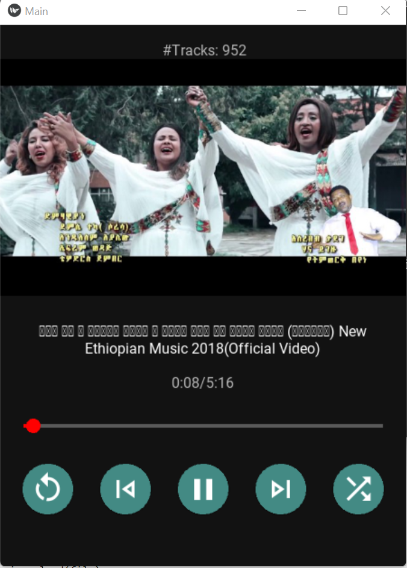

# music_app_kivy
This app is still in development.

An experimental music player using the kivy library.
Audio Music tracks are downloaded from youtube music channels like Hope Music Entertainment, Awtar, MinewShewa and Nahom Records.

The main goal is to stream only audio part from the channels. PyTube python library is used to do that. However, due to changes/updates on youtube,
the pytube libary most likely will break until the next fix. So, for now the player only plays downloaded audio tracks in local disk.

